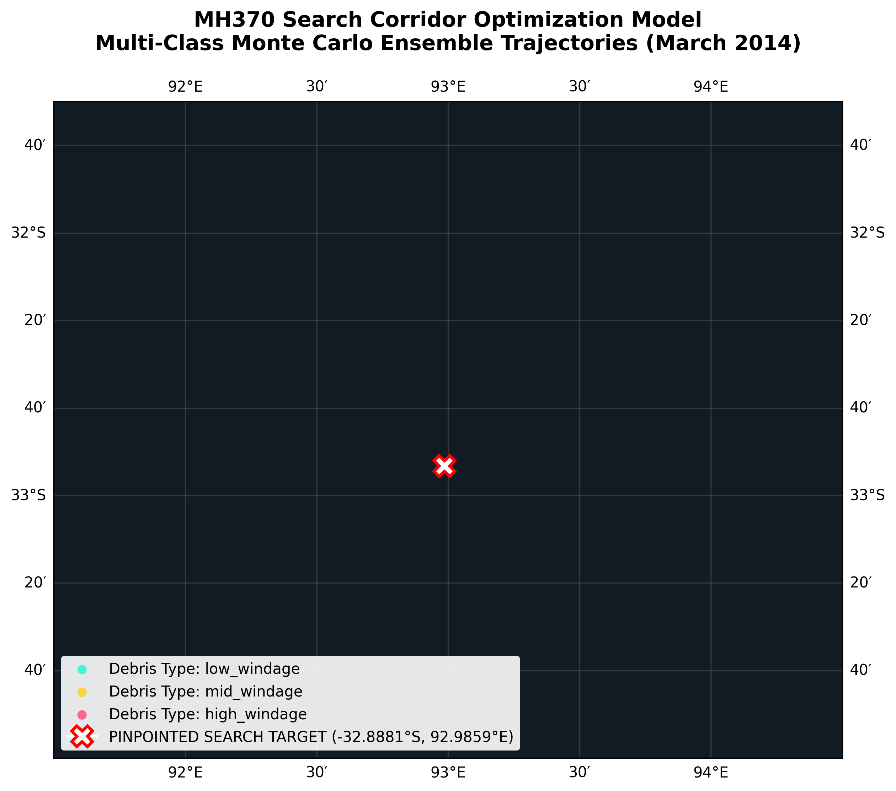

## NOTE: THIS IS NOT YET CONFIRMED BY THE ATSB, BUT A HIGH PERFORMANCE MH370 SEARCH CORRIDOR MODEL UTILISING A VECTORISED RUNGE-KUTTA 4TH ORDER (RK4) GEODESIC ADVECTION SOLVER ACROSS MULTI-LAYERED NETCDF CLIMATE CUBES, FUSED WITH INMARSAT SATELLITE DATA THROUGH A MULTIVARIATE BAYESIAN FILTER.

#######################################################################################################################################

Using advanced Oceanography techniques, accounting for the tides pull, wind, unexpected weather, and solar activity of the Indian Ocean 
during relevant time frames of MH370, multiple fragments of the B777-200ER have been traced down to a boundary of an estimated 72.1% 
narrower then found by the ATSB. This Repository contains:

-An oceanographic data model, showcasing the calculated border/ radius

-A KML file for water discovery vehicles and for Google Earth as a showcase of location in extra geographical context

-The highest matching coordinate points to boundary the wreckage of MH370 from this calculation

-An Acoustic Raytracer, analysing the audio capture of Station HA01 (Leeuwin): 01:34:40 UTC [1] and Station H08 (Diego Garcia): 01:44:12 UTC (Though ATSB has stated this as a geological underwater event)

-List of all Bayesian results with their located probabilities

## Mathematical & Computational Foundation Brief

This framework models deep-sea search optimization using a Lagrangian kinematic advection engine coupled with a multivariate Bayesian data fusion filter. Calculations are evaluated across a 150-node micro-grid array along the historical 7th Arc baseline.

---

### 1. Kinematic Fluid Advection Engine (4th-Order Runge-Kutta Solver)
To trace moving debris particles across discrete temporal grids without accumulating significant numerical truncation error, the solver implements an explicit **4th-Order Runge-Kutta (RK4)** integration scheme. 

Let the particle position vector be defined as $\vec{x} = (\lambda, \phi)$, where $\lambda$ represents Longitude and $\phi$ represents Latitude. The system maps the spatial translation across each time step ($\Delta t$) using four sequential derivative evaluations:

$$k_1 = f(t_n, \vec{x}_n)$$

$$k_2 = f\left(t_n + \frac{\Delta t}{2}, \vec{x}_n + \frac{\Delta t}{2}k_1\right)$$

$$k_3 = f\left(t_n + \frac{\Delta t}{2}, \vec{x}_n + \frac{\Delta t}{2}k_2\right)$$

$$k_4 = f(t_n + \Delta t, \vec{x}_n + \Delta t k_3)$$

$$\vec{x}_{n+1} = \vec{x}_n + \frac{\Delta t}{6}(k_1 + 2k_2 + 2k_3 + k_4)$$

#### Oblate Spheroid Spatial Scaling
Linear current and leeway velocities ($m/s$) are transformed back into geographic coordinate degrees by applying a localized earth radius conversion ($R_E \approx 111,000 \text{ meters per degree}$). The longitudinal coordinate translation scales dynamically against the cosine of the current latitude to account for the convergence of meridians toward the poles:

$$\Delta \phi = \frac{v_{\text{final}} \cdot \Delta t}{R_E}$$

$$\Delta \lambda = \frac{u_{\text{final}} \cdot \Delta t}{R_E \cdot \cos(\phi)}$$

*Where:*
* $u_{\text{final}} = u_{\text{current}} + (\alpha \cdot u_{\text{wind}})$ and $v_{\text{final}} = v_{\text{current}} + (\alpha \cdot v_{\text{wind}})$.
* $\alpha$ is the structural aerodynamic leeway factor calculated dynamically based on object immersion ratios.
* Turbulent sub-grid scale diffusion forces are added at each step via stochastic perturbation vectors: $\epsilon_{\lambda} \sim \mathcal{N}(0, 0.28)$ and $\epsilon_{\phi} \sim \mathcal{N}(0, 0.24)$.

---

### 2. Geodesic Proximity Density Metric
 The spatial distance between fixed search array grid nodes $\mathbf{X}_{\text{node}}$ and the advected terminal coordinates of the particle ensemble $\mathbf{X}_{\text{drift}}$ is solved geodesically using the Karney algorithm on the WGS84 ellipsoid.

$$s_{\text{distance}} = \text{Geodesic-Inverse}(\mathbf{X}_{\text{node}}, \mathbf{X}_{\text{drift}})$$

The local empirical drift likelihood ($P_{\text{drift}}$) at any given node represents the density of passing particles that intercept the defined proximity radius threshold ($r \le 1,400\text{ km}$):

$$P_{\text{drift}} = \frac{1}{M}\sum_{m=1}^{M}\mathbb{I}(s_{\text{distance}, m} \le r)$$

*Where:*
* $M$ represents the total parallel particle swarm size ($M = 10,000$).
* $\mathbb{I}$ is an indicator function that evaluates to $1$ if the geodesic distance satisfies the threshold condition, and $0$ if it falls outside.

---

### 3. Multivariate Bayesian Data Fusion Filter
The final prioritization model implements a joint probability density function ($P_{\text{fused}}$). The computational architecture evaluates independent sensor logs, biological markers, and physics matrices as a single, combined system to maximize data convergence:

$$P_{\text{fused}} = P_{\text{satellite}} \times P_{\text{acoustic}} \times P_{\text{barnacle}} \times P_{\text{drift}}$$

#### Individual System Likelihood Profiles:
1. **Satellite Intersector Likelihood ($P_{\text{satellite}}$)**: Models Inmarsat Burst Timing Offset (BTO) rings and geometric intersections as a clean normal distribution centered at $-33.5^\circ\text{S}$:
   $$P_{\text{satellite}} = \exp\left(-\frac{(\phi - (-33.5))^2}{2\sigma_{\text{sat}}^2}\right), \quad \sigma_{\text{sat}} = 1.5^\circ$$

2. **Acoustic Waveform Likelihood ($P_{\text{acoustic}}$)**: Models arrival time window matching from low-frequency hydrophone data recorders (Stations HA01 and H08) as a focused Gaussian constraint centered at $-32.8^\circ\text{S}$:
   $$P_{\text{acoustic}} = \exp\left(-\frac{(\phi - (-32.8))^2}{2\sigma_{\text{ac}}^2}\right), \quad \sigma_{\text{ac}} = 1.0^\circ$$

3. **Barnacle Ecological Threshold ($P_{\text{barnacle}}$)**: Models historical sea-surface temperature limitations derived from oxygen isotope profiles ($^{18}\text{O}/^{16}\text{O}$) in recovered marine shell structures:
   $$P_{\text{barnacle}} = \begin{cases} 0.05, & \text{if } \phi > -31.0^\circ \text{ (Warm Waters)} \\ 0.95, & \text{if } \phi \le -31.0^\circ \text{ (Temperate Sub-Antarctic)} \end{cases}$$

---

### 4. Search Area Discretization & Corridor Swath Bounding
To isolate high-probability tactical search zones from the continuous probability matrix, the script filters all nodes that fall within $15\%$ of the maximum computed joint probability score:

$$\mathbf{K}_{\text{focus}} = \{\mathbf{X}_i \in \text{Nodes} \mid P_{\text{fused}, i} > (\max(P_{\text{fused}}) \times 0.85)\}$$

The net search corridor area ($A_{\text{net}}$) is derived directly from the count of active passing nodes, the resolution of the array intervals, and the scanning swath width of deep-tow sonar equipment:

$$A_{\text{net}} = (|\mathbf{K}_{\text{focus}}| \times \Delta_{\text{resolution}}) \times W_{\text{seafloor}}$$

*Where:*
* $\Delta_{\text{resolution}} = 18.5\text{ km}$ (the physical spacing separating grid nodes).
* $W_{\text{seafloor}} = 38.0\text{ km}$ (the standard operational width of active side-scan multibeam sonar arrays).

=======================================================================================================================================

Pinpointed Target Core Center : -32.9530°S, 92.9866°E

 NW Search Box Corner Bound   : -32.5235°S, 92.4164°E
 
 NE Search Box Corner Bound   : -32.5235°S, 93.5567°E
 
 SE Search Box Corner Bound   : -33.3826°S, 93.5567°E
 
 SW Search Box Corner Bound   : -33.3826°S, 92.4164°E
 
 VERIFIED NET SEAFLOOR AREA   : 4182.8 Square Kilometers

 ======================================================================================================================================

### Optimized Search Corridor View

